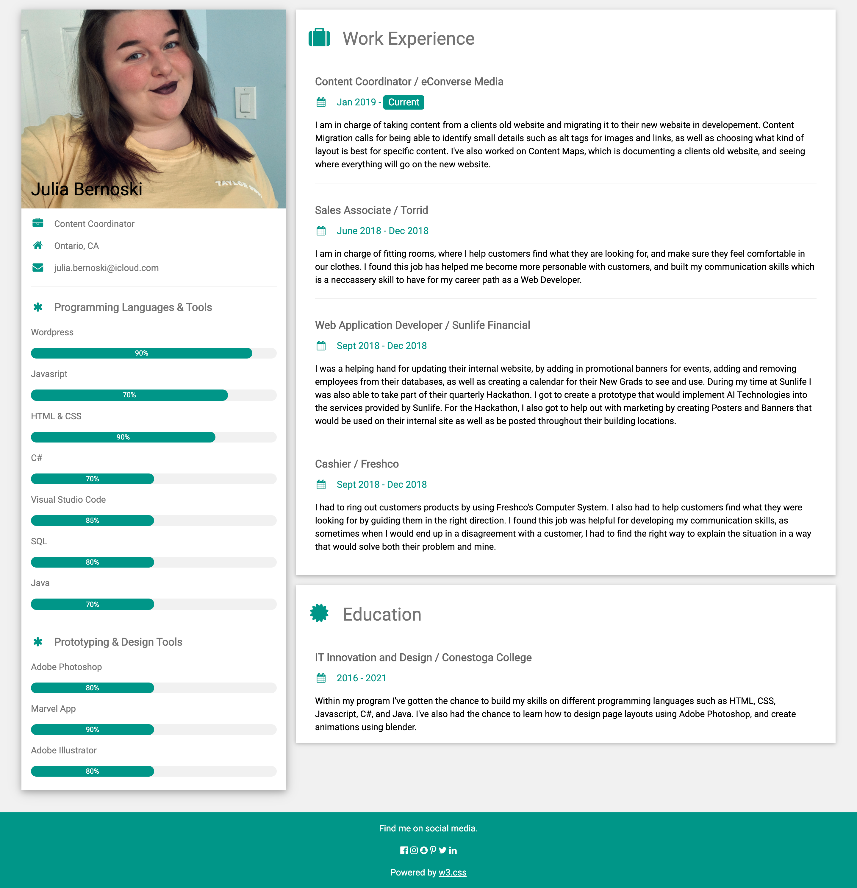

# Assignment 3 - Continuous Integration
**By: Julia Bernoski**
## Description
This is an online resume HTML Page. It can be used as a template, or for my personal use to send to future employers. 
## Installation
Clone the Repository:
```bash
git clone https://github.com/jbernoski2013/info2300-jba03.git
```
Create your own repository on the command line:
```bash
- git init
- git add README.md
- git commit -m "first commit"
- git add orgin https://github.com/jbernoski2013/info2300-jba03.git
- git push -u orgin master
```
You can also download the repository and view it that way or fork the repository. 

```bash
[![View Live Portfolio that is hosted on Heroku &raquo;]] (https://info2300-jba03.herokuapp.com/)
```

